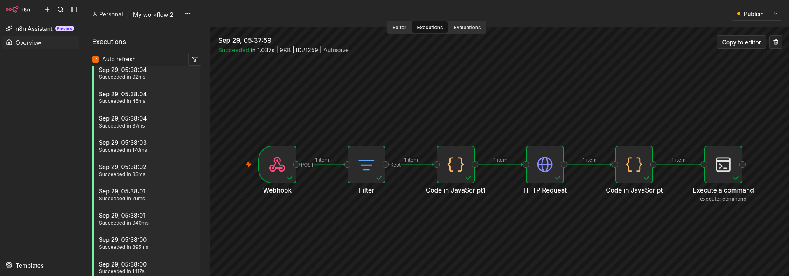
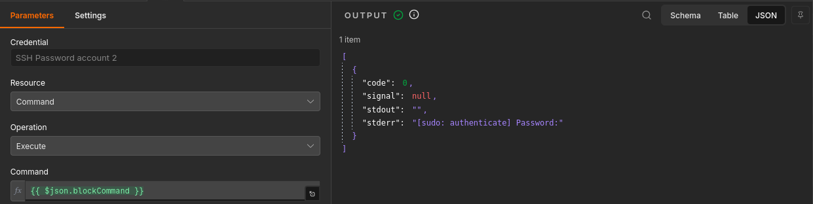
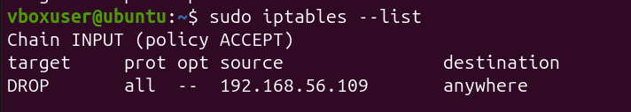

# 🛡️ Automated Incident Response & SOAR Platform


A professional-grade **Security Orchestration, Automation, and Response (SOAR)** platform designed to detect, enrich, and automatically mitigate SSH brute-force attacks in real time.

---

## 📐 System Architecture

```text
+------------------+          +------------------+          +------------------+
|                  |  SSH     |                  | Logs     |                  |
|  Attacker (Kali) | -------> |   Ubuntu Agent   | -------> |  Wazuh Manager   |
|                  |  Brute   |   (Target Machine)          |    (SIEM/EDR)    |
+------------------+  Force   +------------------+          +------------------+
^                            |
| Execute                    | Webhook
| iptables DROP              v
+------------------+          +------------------+          +------------------+
|                  |  Enrich  |                  | JSON     |                  |
|   AbuseIPDB API  | <------- |    n8n Engine    | <------- | Custom Integrat. |
|  (Threat Intel)  |  Reput.  |   (SOAR Engine)  |  Alert   | (custom-n8n.py)  |
+------------------+          +------------------+          +------------------+
```

---

## ⚡ Key Features & Workflow Logic

1. **Detection & Ingestion**
   * Wazuh SIEM continuously monitors authentication logs (`/var/log/auth.log`).
   * High-severity alerts ($\ge 5$) trigger an automated response script (`custom-n8n.py`) via Wazuh's Integration Daemon.

2. **Parsing & Filtering**
   * The incoming HTTP POST webhook payload is normalized inside **n8n**.
   * Non-critical alerts are filtered out to reduce processing overhead.

3. **Threat Intelligence Enrichment**
   * Queries the **AbuseIPDB REST API** using the attacker's source IP address to fetch confidence scores, domain registration, and abuse history.

4. **Idempotent Automated Remediation**
   * Connects via SSH to the target machine (Ubuntu Agent).
   * Executes a conditional command using `iptables -C` before applying `iptables -A`.
   * **Result:** Prevents duplicate firewall rule creation and avoids memory bloat during mass-attack vectors.

5. **Security Hardening**
   * No hardcoded credentials or passwords in exported workflows.
   * Leverages environment variables and n8n credential stores.

---

## 🔄 Modularity & Extensibility

This platform features a **fully decoupled architecture**. While this deployment demonstrates SSH brute-force remediation, the downstream SOAR response engine is completely agnostic to the attack vector:

* **Web Application Attacks (SQLi, XSS, Path Traversal):** Ingest Web Server logs (Nginx/Apache) into Wazuh $\rightarrow$ Trigger automated containment.
* **Reconnaissance (Nmap Port Scans):** Pair Suricata IDS or firewall logs with Wazuh $\rightarrow$ Instant dynamic IP block.
* **Zero-Code Pipeline Changes:** Any Wazuh alert generating a source IP (`srcip`) above severity level 5 triggers this exact remediation pipeline without modifying the n8n workflow or script logic.


## 🖼️ Proof of Concept & Validation

### 1. n8n SOAR Workflow Execution
All nodes executed successfully upon receiving the alert payload:



### 2. Remote SSH Command Output
The execution node receives status `code: 0`, confirming rule injection:



### 3. Verification on Ubuntu Target (`iptables`)
The attacker IP (`192.168.56.109`) is dynamically appended to the `INPUT` chain:



```bash
$ sudo iptables -L INPUT -n -v
Chain INPUT (policy ACCEPT 120 packets, 8400 bytes)
 pkts bytes target     prot opt in     out     source               destination         
    5   300 DROP       all  --  *      *       192.168.56.109       0.0.0.0/0           
🚀 Deployment Guide
Prerequisites
Wazuh Manager (Docker container or standalone server)

n8n Instance (Self-hosted via Docker or Cloud)

Target Linux Machine with SSH access and iptables installed

AbuseIPDB API Key (Free tier)

1. Wazuh Manager Setup
Copy scripts/custom-n8n.py to /var/ossec/integrations/ inside your Wazuh Manager container:

Bash
cp scripts/custom-n8n.py /var/ossec/integrations/custom-n8n.py
chmod 750 /var/ossec/integrations/custom-n8n.py
chown root:wazuh /var/ossec/integrations/custom-n8n.py
Add the integration block to /var/ossec/etc/ossec.conf:

XML
<integration>
  <name>custom-n8n.py</name>
  <hook_url>http://<N8N_HOST>:5678/webhook/wazuh-alerts</hook_url>
  <level>5</level>
  <alert_format>json</alert_format>
</integration>
Restart Wazuh Manager:

Bash
/var/ossec/bin/wazuh-control restart
2. n8n Workflow Import
Open n8n and select Workflows > Import from File.

Select n8n/workflow-v2.json.

Configure your AbuseIPDB API Key in the HTTP Request node.

Configure your SSH Credentials in the Execute Command node.

Activate the workflow (Publish).

🔒 Security Considerations
Rule Duplication Mitigation: By using iptables -C INPUT -s <IP> -j DROP 2>/dev/null || iptables -A INPUT -s <IP> -j DROP, the engine ensures rules remain idempotent even under multi-threaded brute-force floods.

Privilege Separation: In production environments, replace plain SSH password invocation with dedicated visudo entries (NOPASSWD: /usr/sbin/iptables) and SSH key authentication.